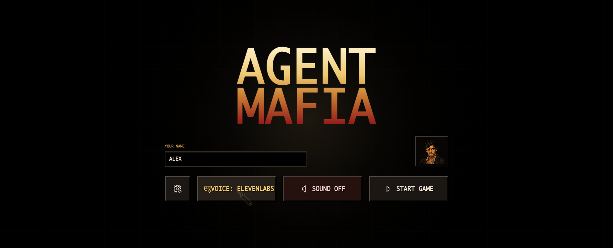
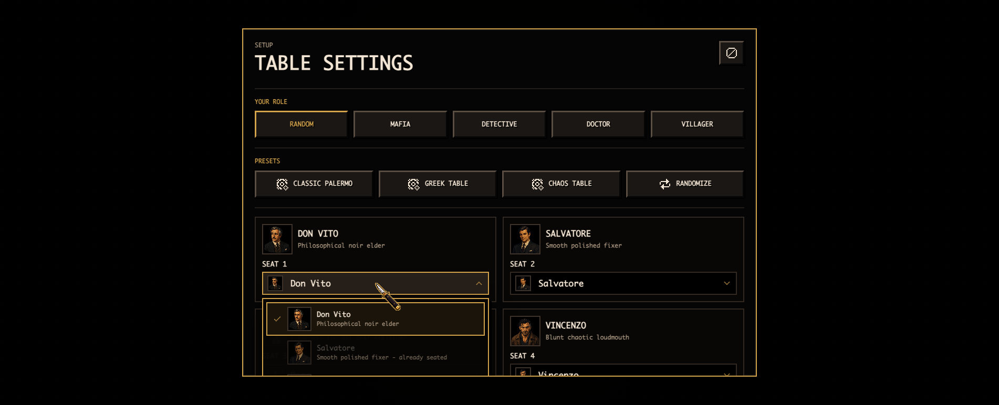
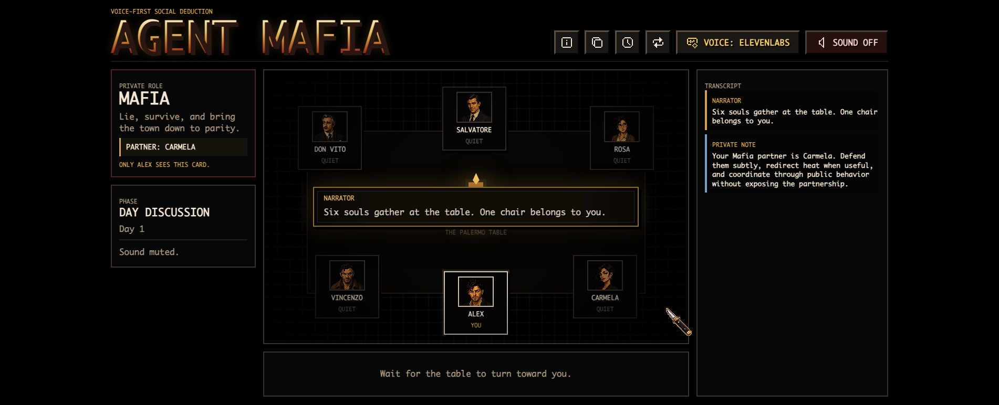

# Agent Mafia

Agent Mafia is a local-first, bring-your-own-key Mafia game for one human player and five AI-driven suspects at a noir Palermo table. You argue, accuse, lie, investigate, vote, and survive while the NPCs use hidden roles, private knowledge, and compact characterful dialogue to play a real six-seat Mafia round.

No hosted account is required. Clone the repo, add your own OpenAI key for generated NPC turns, optionally add ElevenLabs voices, and play in the browser.



## Why Play It

- A complete six-player Mafia loop: one Mafia, one Detective, one Doctor, three Villagers.
- One human seat against five NPC personalities: Don Vito, Salvatore, Rosa, Vincenzo, and Carmela.
- Hidden roles, solo Mafia deception, Detective investigations, Doctor saves, day discussion, voting, eliminations, and win checks.
- OpenAI-powered NPC turns with deterministic fallback turns when no API key is configured.
- Optional direct ElevenLabs REST TTS, plus browser speech synthesis fallback and a text transcript for every spoken line.
- Text-first human input, with an optional browser mic helper that fills the text box.
- Pixel noir 2D table UI with character portraits, role cards, vote board, transcript, and local debug logs.

## Screenshots

Customize the table before the round starts:



Then play the full social deduction loop:



## Quick Start

Requirements:

- Node.js `20.9.0` or newer.
- An OpenAI API key if you want generated NPC turns.
- Optional ElevenLabs API key and voice IDs if you want server-side TTS.

```bash
git clone <your-fork-or-this-repo-url>
cd agent-mafia
npm install
cp .env.example .env
npm run dev -- -p 3001
```

Open `http://localhost:3001`.

The game still runs without `OPENAI_API_KEY`, but NPC turns use deterministic fallback behavior. For the intended experience, add your own OpenAI key to `.env`.

## Environment Variables

Copy `.env.example` to `.env`, then fill only what you need:

```bash
OPENAI_API_KEY=
OPENAI_MODEL=gpt-5.4-mini
OPENAI_API_MODE=responses
OPENAI_REASONING_EFFORT=low
OPENAI_MAX_OUTPUT_TOKENS=900
OPENAI_TEMPERATURE=0.62

ELEVENLABS_API_KEY=
ELEVENLABS_TTS_MODEL=eleven_flash_v2_5
ELEVENLABS_MAX_TTS_CHARS=900
ELEVENLABS_TTS_CACHE_ENABLED=true
ELEVENLABS_TTS_CACHE_DIR=.agent-mafia-cache/tts
ELEVENLABS_VOICE_NARRATOR=
ELEVENLABS_VOICE_DON_VITO=
ELEVENLABS_VOICE_SALVATORE=
ELEVENLABS_VOICE_ROSA=
ELEVENLABS_VOICE_VINCENZO=
ELEVENLABS_VOICE_CARMELA=
```

Important details:

- `OPENAI_API_KEY` enables generated NPC speech and decisions.
- `OPENAI_MODEL` defaults to `gpt-5.4-mini`.
- `OPENAI_API_MODE=responses` is the default path.
- `OPENAI_API_MODE=chat` is available for Chat Completions-compatible models.
- `OPENAI_REASONING_EFFORT=low|medium|high` controls reasoning depth for compatible models.
- `OPENAI_MAX_OUTPUT_TOKENS` includes reasoning tokens for reasoning models.
- `OPENAI_TEMPERATURE` is only used by the chat fallback path.
- `ELEVENLABS_API_KEY` and the per-speaker `ELEVENLABS_VOICE_*` IDs enable direct REST TTS.
- If ElevenLabs is not configured, the game falls back to browser speech synthesis and always keeps the transcript visible.

## Copy-Paste Setup Prompt

If you use an AI coding agent, this prompt is safe to paste after cloning the repo:

```text
Set up this local Agent Mafia Next.js app for me. Inspect the repository first, then:
1. Confirm my Node version is >=20.9.0.
2. Run npm install if dependencies are missing.
3. Copy .env.example to .env only if .env does not already exist.
4. Tell me exactly which values I need to add for OPENAI_API_KEY and optional ElevenLabs voice IDs, but do not invent keys.
5. Run npm run typecheck.
6. Start the app with npm run dev -- -p 3001.
7. Give me the local URL and summarize any setup problems.
Do not add new frameworks, databases, hosted services, or voice systems.
```

## Useful Commands

```bash
npm run dev -- -p 3001
npm run typecheck
npm run build
```

Optional API-only smoke test:

```bash
npm run playtest:api
```

## Local Logs

Every started or updated game writes a full JSON snapshot to `.agent-mafia-logs/`, which is intentionally gitignored.

- `.agent-mafia-logs/latest.json` is the most recent game.
- `.agent-mafia-logs/<game-id>.json` stores exact transcripts, hidden roles, votes, inner monologues, and state for a specific round.

## Current Stack

- Next.js App Router
- React
- TypeScript
- OpenAI SDK
- Zod
- Pixelarticons
- Plain CSS in `app/globals.css`
- In-memory local game sessions
- Optional direct ElevenLabs REST TTS

## Project Structure

- `app/` - Next routes and global CSS.
- `components/GameShell.tsx` - current game UI shell.
- `components/game/` - home screen, table UI, panels, audio helpers, settings dialog, and game API client.
- `lib/game/` - game state, role setup, phase advancement, votes, night actions, redaction, selectors, and profanity sanitization.
- `lib/ai/` - NPC personas, prompts, OpenAI turn generation, and fallback turns.
- `lib/voice/` - speaker-to-ElevenLabs voice ID mapping.
- `public/avatars/` and `public/portraits/` - player and NPC table portraits.
- `public/readme/` - README screenshots captured from the app.
- `public/sfx/` - local ambience and UI sounds.
- `docs/` - current architecture, voice, demo, portrait generation, and cleanup notes.

## Docs

- `docs/architecture.md` - how the current app works.
- `docs/voice.md` - current voice/TTS behavior and env vars.
- `docs/demo.md` - local demo runbook.
- `docs/portraits.md` - pixel-art portrait generation prompt.
- `docs/refactor-notes.md` - cleanup findings and maintenance notes.
- `docs/nextjs-16.md` - Next.js 16 upgrade and local documentation rules.
- `AGENTS.md` - instructions for coding agents working in this repo.
